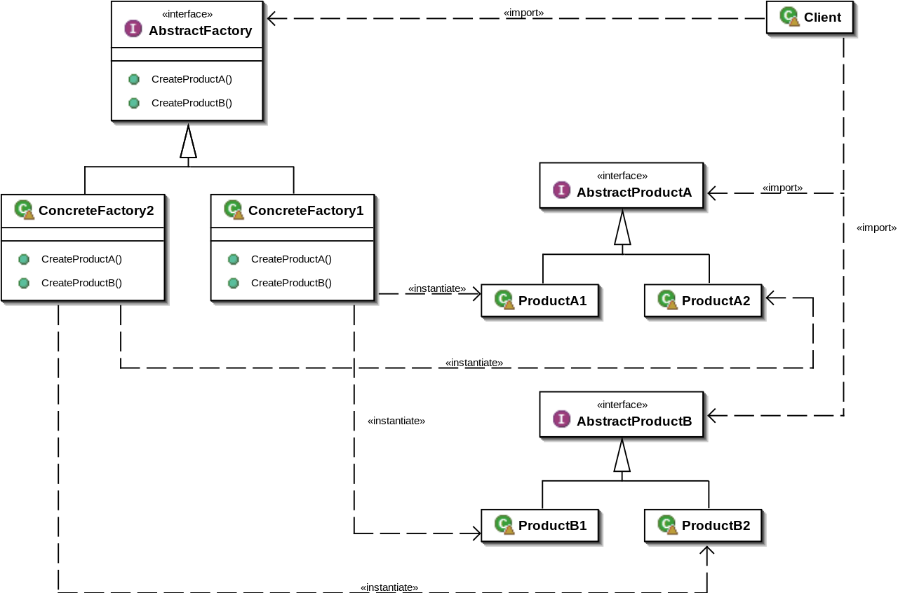

# Abstract Factory

## Description:

**Abstract Factory** is a creational design pattern that lets you produce families of related objects without specifying their concrete classes.

The first thing the Abstract Factory pattern suggests is to explicitly declare interfaces for each distinct product of the product family. Then you can make all variants of products follow those interfaces. 

* Use the Abstract Factory when your code needs to work with various families of related products, but you don’t want it to depend on the concrete classes of those products—they might be unknown beforehand or you simply want to allow for future extensibility.

The Abstract Factory provides you with an interface for creating objects from each class of the product family. As long as your code creates objects via this interface, you don’t have to worry about creating the wrong variant of a product which doesn’t match the products already created by your app.

## Diagram:

## Java Example:

In Java example, buttons and checkboxes will act as products. They have three variants: macOS, Linux and Windows.

The abstract factory defines an interface for creating buttons and checkboxes. There are three concrete factories, which return both products in a single variant.

Client code works with factories and products using abstract interfaces. It makes the same client code working with many product variants, depending on the type of factory object.