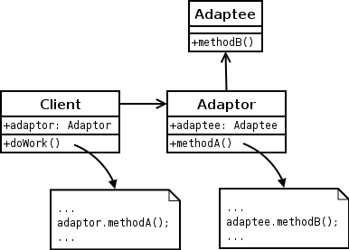

# Adatper

## Description:

**Adapter** is a structural design pattern that allows objects with incompatible interfaces to collaborate.

An adapter wraps one of the objects to hide the complexity of conversion happening behind the scenes. The wrapped object isn’t even aware of the adapter. For example, you can wrap an object that operates in meters and kilometers with an adapter that converts all of the data to imperial units such as feet and miles.

Adapters cannot only convert data into various formats but can also help objects with different interfaces collaborate. Here’s how it works:

1. The adapter gets an interface, compatible with one of the existing objects.
2. Using this interface, the existing object can safely call the adapter’s methods.
3. Upon receiving a call, the adapter passes the request to the second object, but in a format and order that the second object expects.

**Applicability:**
- Use the Adapter class when you want to use some existing class, but its interface isn’t compatible with the rest of your code.
- Use the pattern when you want to reuse several existing subclasses that lack some common functionality that can’t be added to the superclass.
  
## Diagram:

## Java Example:

Java example of the **Adapter** pattern is based on the classic conflict between square pegs and round holes.

The Adapter pretends to be a round peg, with a radius equal to a half of the square’s diameter.