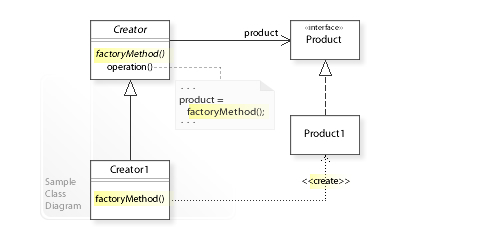

# Factory Method

## Description:
**Factory Method** is a creational design pattern that provides an interface for creating objects in a superclass, but allows subclasses to alter the type of objects that will be created.

The Factory Method pattern suggests that you replace direct object construction calls (using the new operator) with calls to a special *factory method*. 

**Applicability:**
* Use the Factory Method when you don’t know beforehand the exact types and dependencies of the objects your code should work with.
* Use the Factory Method when you want to provide users of your library or framework with a way to extend its internal components.
* Use the Factory Method when you want to save system resources by reusing existing objects instead of rebuilding them each time.

## Diagram:

## Java Example:

In Java Example Buttons play a product role and dialogs act as creators.

Different types of dialogs require their own types of elements. That’s why we create a subclass for each dialog type and override their factory methods.

Now, each dialog type will instantiate proper button classes. Base dialog works with products using their common interface, that’s why its code remains functional after all changes.

 