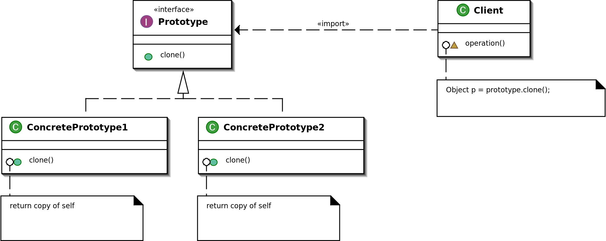

# Prototype

## Description:

**Prototype** is a creational design pattern that lets you copy existing objects without making your code dependent on their classes.

The Prototype pattern delegates the cloning process to the actual objects that are being cloned. The pattern declares a common interface for all objects that support cloning. 

**Applicability:**
* Use the Prototype pattern when your code shouldn’t depend on the concrete classes of objects that you need to copy.
* Use the pattern when you want to reduce the number of subclasses that only differ in the way they initialize their respective objects. Somebody could have created these subclasses to be able to create objects with a specific configuration.

## Diagram:

## Java Example:

In Java example, the Prototype pattern lets to produce exact copies of geometric objects, without coupling the code to their classes.

All shape classes follow the same interface, which provides a cloning method. A subclass may call the parent’s cloning method before copying its own field values to the resulting object.